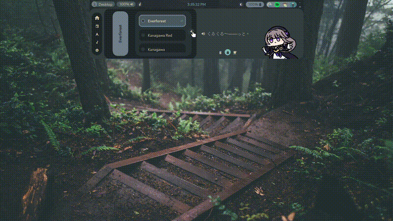

# kurukuruBar

> ## 📽️ Showcase


> Colors are kinda off in this gif will replace it with a vid later

## Getting Started

1.  **Install Quickshell:** Make sure you have quickshell installed on your system. You can install it from the package manager or from the source, check and follow install directions [here](https://quickshell.outfoxxed.me/docs/guide/install-setup/)

2.  **Clone the Repository:** Clone the repository to your desired location. The example below uses `~/.config/quickshell/kurukuruBar` where i have it personally.
    ```bash
    git clone https://github.com/krishna4a6av/kurukuruBar.git ~/.config/quickshell/kurukuruBar/
    ```

3.  **Running the Bar:** You have two options:

    *   **Directly with Quickshell:**
        You can run the bar directly using the `qs` command, replacing the path with the actual path to your `shell.qml` file.
        ```bash
        qs -p /path/to/your/kurukuruBar/shell.qml
        ```

    *   **Using the Toggle Script (Recommended):**
        I have included a helper script is included to easily start and stop the bar.
        First, make it executable:
        ```bash
        chmod +x ~/.config/quickshell/kurukuruBar/Scripts/toggle_kuru.sh
        ```
        Then, run the script to toggle the bar:
        ```bash
        ~/.config/quickshell/kurukuruBar/Scripts/toggle_kuru.sh
        ```

4.  **(Optional) Keybinding:** For easy access, bind the toggle script to a key in your window manager's configuration.(Make sure to update the path in toggle_Script.sh if you move it from the /scripts folder)

>To see all the keybinds while the bar is running press alt+/

# kurukuruBar Dependencies

This is an auto-generated list of dependencies for kurukuruBar based on its files. You should have most of them but if something does not work you can crosscheck from these.

## Dependencies

*   **quickshell:** The primary application, used to run the bar.
*   **Qt:** As Quickshell is based on Qt, should automatically install with quickshell.
*   **Pipewire:** Used for audio control.
*   **brightnessctl:** Used for brightness control.
*   **UPower:** Used for battery information.
*   **gpurecording:** A script or application for screen recording.
*   **nmcli:** Used for network information.
*   **systemctl:** Used for session management (suspend, reboot, poweroff).
*   **Material Symbols Rounded**
*   **Nerd Font**


> *  To keep in mind: This is built around hyprland, so running it on other DE or WM might varying sucess. It should work but some components will not, And will require chnages/debugging.


> Originally based on the work of Rexiel Scarlet - https://github.com/Rexcrazy804/Zaphkiel.git


